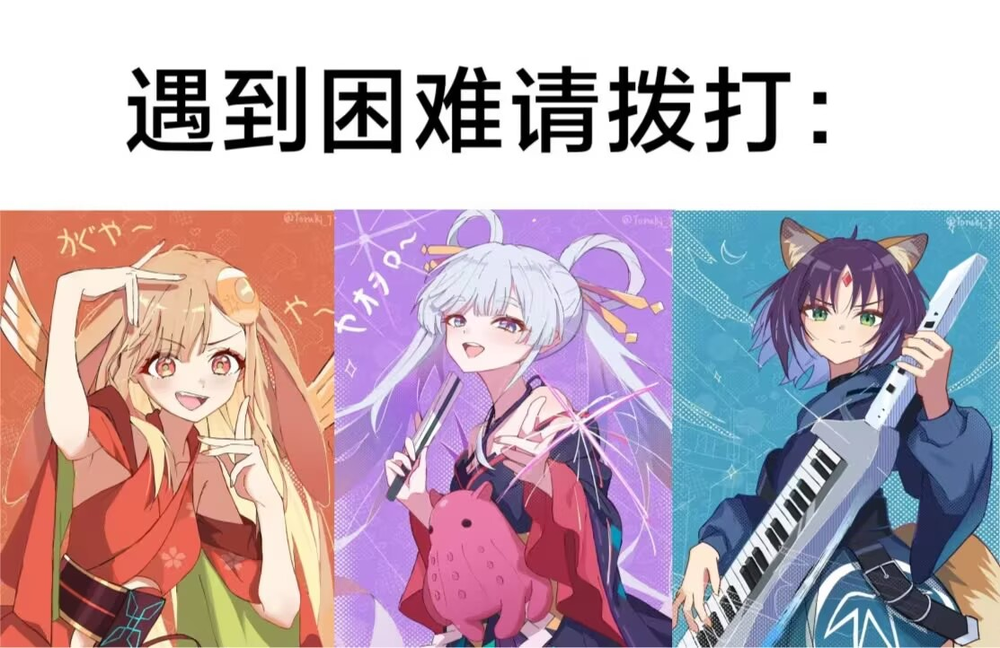

+++
title = "超时空辉夜姬!"
date = '2026-03-02T19:38:00+08:00'
draft = false
background = "bg4.jpeg"
[article]
showHero = true
heroStyle = "background"
+++

### 超时空辉夜姬!

    

        既然辉夜姬是从竹子中取出所以书被命名为《竹取物语》, 
        而彩叶从电线杆取出辉夜,《超时空辉夜姬!》是不是可以叫
        <s>《电棍物语》</s>?
    

由于写篇笔记实在是太累了,所以看完之后一直没有写.但是超时空辉夜姬!真的是一部好作品!
我是在大年初一看完的,虽然我没有向龙与虎一样感叹和失落,但是我还是很喜欢彩叶,八千代和辉夜(虽然这是一个人)的,而且不那么难过主要是~~我不是女同~~剧情稀烂.
首先客观评价一下,这部动漫的缺点:太短.这一个缺点导致了无穷无尽的缺点,比如故事仓促,剧情逻辑不通顺,如果拍成番剧可能会更好一点,但是瑕不掩瑜,即使有这么明显的缺点,其制作水平和内涵依然是顶级的,下面我会从这几个角度好好~~夸一夸~~评价这部动画片.
#### 背景
首先,我们需要了解,辉夜姬是个什么?
**辉夜姬”（かぐや姫，Kaguya-hime)**:
*日文学原型* 为日本文学之祖《竹取物语》（たけとりものがたり,这本书是"物语"这个类型作品的代表作之一,名气更大的有源氏物语,"物语"就是故事杂谈的意思.大概故事就是:

> 一位伐竹老翁在发光的竹子里发现了一个只有三寸长的小女孩，带回家后她迅速长大，美貌惊世。老翁也在伐竹时不断发现黄金，变得富有。五位显赫的贵族向她求婚。辉夜姬提出了五件“不可能的任务”作为聘礼：
天竺佛陀的石钵（求婚者以假货蒙骗，被识破）
蓬莱仙山的玉枝（求婚者找工匠伪造，被识破）
中国的火鼠裘（求婚者买到假货，入火即焚）
龙首之珠（求婚者遇风暴吓破胆，放弃）
燕子的子安贝（求婚者摸到燕粪跌落摔伤）
就连当时的最高权力者“帝”（天皇）追求她，她也以“我非此地之人”为由婉拒，仅以和歌书信往来。后来, 辉夜姬坦白自己来自月宫（月之都），因罪下凡，期限已满。尽管老翁派重兵把守，但月宫使者带着云彩和飞车降临时，凡人无法抵抗。
临行前，她穿上“天之羽衣”（披上后会忘却人间所有情感），并留下了长生不老药。天皇因失去辉夜姬，认为长生无意义，命人在日本最高的山上焚烧此药，那座山从此被称为“不死山”（即富士山，Fuji音近“不死”）。

那这个故事有什么特别的呢?我们认为:
- 对权力的蔑视:在等级森严的平安时代，辉夜姬拒绝所有权贵（包括天皇），象征着一种个体的独立与自由。
- “物哀”与孤独： 辉夜姬总是望着月亮流泪，这种“不属于这个世界”的疏离感，触动了人类内心深处对孤独的共鸣。
- 无常观： 无论人间多么繁华、感情多么深厚，最终都要“羽衣一披，万事皆忘”，这种对生命短暂与虚无的感叹是日本审美核。

这是一个充满日本特色的物哀BE故事,那下一版的辉夜姬是什么样的呢?
*吉卜力*在2013年拍了一版大概内容为:
强调“生的喜悦”。这一版的辉夜姬渴望土地、昆虫和贫穷但真实的生活。她回到月亮不是因为期满，而是因为她在受苦时向月亮求救了。
这是一个关于“后悔”和“母性”的故事。
接下开就是这一版的辉夜姬,如果你看过原电影,就会发现这完完全全背叛了故事原型,反驳了或者重构了原来的价值观,这个我们在后面后进一步讨论
#### 音乐
首先,这是半个乐队番(?),所以音乐的确很好听,但是很多人会注意到这首曲子(remember),其作为全片的高潮被三位主角演唱,当时我觉得有点耳熟,但是没听出来,后来发出现这是初音的经典名曲:世界第一的公主殿下的改版,虽然我不听初音,也不是miku的粉丝,但是经了解,这首歌是Vocaloid(术力口)的“国歌”,在这首歌被ryo创作之前,初音只是一个唱歌的小软件,而这首歌可以说创造了一个初音未来,那肯定有人要问,初音和辉夜姬有什么关系呢?我们发现,《竹取物语》中的辉夜姬,电影中的辉夜姬和这首歌中的初音未来进行了身份叠映:
- 身份的讽刺： 传统的辉夜姬是“被迫”当公主的，她被禁锢在深宅大院，被五个贵族和天皇觊觎。她虽然名为公主，却没有自由,这与世界第一的公主殿下中初音一个鲜活的、略带骄纵、充满自信的“小公主（Ohime-sama）”人格恰恰相反
- 觉醒的瞬间：当2026版电影中的辉夜姬在涩谷街头狂奔，背景乐响起《世界第一的公主殿下》时，歌词中的“那种理所当然的事情，现在就要做到”变成了一种强烈的主权宣示,而初音的诞生,歌词里那种“要把我当成世界第一来对待”的宣言，在相对压抑的现实社会中，给无数年轻人提供了一个释放自我、拥抱“自我中心主义”和主权宣示的出口。
当然,类似的解读可能还有很多,但是,最重要的,这首歌是一把钥匙,当2018年就听过这首歌的人再一次听到,心中的感受会是怎样?我不知道,但是一定是五味杂陈
#### 图像
这部动漫另一个引人称赞的是其图像制作,由于~~netflix十分的有钱~~山下清悟水平较高,本片的制作极为精良,这个可以自己观看,但是几乎帧帧壁纸
#### 核心
下面,我会讲讲自己吸收的内核,并驳斥所谓低立意的批判,其本质的还是在讨论,我们为什么而活?
生命有本质吗?对于辉夜姬,答案是肯定的,在月球,虽然无趣,但是稳定优美,因为月宫本来就是一个"大计算机",人不需要思考“我为什么要活着”，因为人的“功能”就是其存在的全部意义,这意味着什么呢?这意味着完美的结局,算法可以推演出人生的所有路径。月宫会为你屏蔽所有会导致失败、悲伤和意外的变量，直接给你一个“计算出的最优解",这是不是很熟悉?算法为我们提供最好看的视频,最对胃口的晚饭,我们正在被"月宫"支配。而从电影中可以看到,月宫的美是“永恒”的：,电影中月宫的视觉呈现是极简、对称且一尘不染的。但是这也意味着无故事性,“故事”的产生需要冲突、错误和遗憾。因为月宫有“完美的结局”，所以月宫其实是没有故事的。地球呢?地球混乱、痛苦、没有意义,人出生就代表了会死亡,而街边的醉汉,彩叶家庭的矛盾,无一不表明地球是不如月球"优美"的,但这还是吸引了辉夜姬,正是因为生命会消亡、记忆会模糊，当下的那一次表白、那一次牵手才具有“绝对的意义”。
当下的年轻人普遍面临“虚无主义”和“数字倦怠”。电影通过辉夜姬告诉观众：即便你觉得生活是一场注定会输的游戏，你依然拥有“按下开始键”和“定义游戏规则”的权利。你的价值不在于社会给你的标签（公主、学生、职员），而在于你此刻感受到的“痛楚”与“热爱”。
#### 百合
接下来讲一讲一个会让人难以严肃对待的话题:电影中的百合.面对全世界的"正确"和LGBTQ+,中国即使有GFW保护也很难完全杜绝,而且"同性恋娱乐化"变得常见,但是,如何看待本文的百合?
先说一说本文的百合吧,此文中的辉夜的处境远好于辉夜姬,因为不同于原作的归宿被限定在“求婚”与“拒绝求婚”之间,她与彩叶的百合关系彻底切断了这种逻辑。救赎不再来自于“被王子拯救”，而是来自于两个孤独个体之间的“镜像共鸣”,而此时的百合很可能,至少在提到的部分是真正的"百合",两人的爱是一种拯救的力量,是引力,彩叶对辉夜姬的爱，成为了对抗月宫接引光束的唯一“地球引力”。这种同性间的极高度理解，代表了一种纯粹的、非功利性的情感支撑，象征着亚文化圈层内年轻人抱团取暖的真实写照.

接下来我们谈一谈所谓"同性的爱"和"百合":
*  在当代,至少是东亚,现代异性恋爱市场已经变成了一个极其复杂的“存量博弈场”：沉重的经济成本,激化的性别对立,这无不为大家渴望的被理解,被需要所背道而驰,而恰好,现代过剩的性资源在表面解决了需要情侣才能满足的性要求,那人们只需要一个情感依托的个体,相比于猫狗等,人,或者是同性变成了一个很好的对象,而互联网的娱乐性质很好的将原本"难堪的"同性恋解构,变成了"玩笑",因此同性叙事的优势逐渐显现,在理想化的同性感情中,人们可以暂时忘记房贷和生育压力，只关注“人与人的连接”。这种“去社会化”的恋爱，成了当代年轻人的精神避风港。而且,异性恋中强调“差异互补”,而现代年轻人更倾向于寻找“镜像认同”,《超时空辉夜姬！》中,两人如同"镜像"一样,这恰好表明,现代人极度的孤独感已经进一步退化——我们不再渴望被一个“异质”的人救赎，而是渴望被一个“懂我”的人看见。
*  以上是对异性叙事的反驳,同性还是对传统婚姻要求的反叛:
在传统社会中，异性恋婚姻带有强烈的“功能性”（繁衍、财产继承、社会单位）。
同性关系在传统视角下是“无用”的（无法自然繁衍）。然而，在现代存在主义看来，这种“无用”恰恰是最高的自由:
    > 年轻人通过消费同性娱乐内容，实际上是在表达一种潜意识的反抗：“我爱一个人，不是为了组成家庭单位，不是为了完成进化任务，只是因为我想爱。” 同性题材成了这种“纯粹爱欲”的最佳载体。
*  当然,一切的娱乐化离不开资本:
    - 审美消费： 同性题材往往伴随着极高的视觉美感（如片中的辉夜与彩叶）。观众在观看时，获得的是一种“观察者的愉悦”（Voyeuristic pleasure），而非参与者的压力。
    - CP文化（Coupling）： 现代娱乐工业发现，“磕CP”是一种低成本、高回报的情感代入方式。通过将同性关系符号化、标签化（如：冷酷×温顺、天外来客×平凡少女），资本创造了一种极易传播和消费的文化商品。
*  同时,还有一个有趣的隐藏点,由于两性关系在互联网和一个火药桶一样,创作者在写情侣生活细节时,很容易因为处理不当(如家务分配、职场歧视等)引发大规模的性别争议,而同性之间就很少有这种问题,比如:

    创作者发现，描写同性之美往往更“安全”，更容易通过一种“超现实的浪漫”获得全网赞誉。这导致了大量优秀画师、编剧涌入这一赛道，进一步推动了同性题材的视觉与叙事水准,就像上图~~谁也不知道是110还是001~~也没有会因为这个认真的吵起来。
#### 亚文化
本片另一个很好的看点是亚文化的融入,比如上述的术力口,还有vtuber等等,都是互联网文化的体现

**术力口**
 - 这是什么？
    
    “术力口”是Vocaloid（由Yamaha开发的电子语音合成软件）的中文圈昵称。通过输入音阶和歌词，任何人都可以让软件中的“虚拟歌手”（如初音未来、洛天依等）唱歌,后来,一般认为凡是通过虚拟歌姬进行演唱的都被称为术力口。围绕这个软件，诞生了无数的创作者（被称为Vocalo-P）和海量的二创作品（插画、MMD动画等），形成了一个庞大的共创文化圈,在现代互联网,有大量术力口歌曲破圈下沉至短视频平台进行进一步传播,比如耳熟能详的:
    
    
    
    
    
    
    
- 为什么?

    之所以能崛起,离不开对传统音乐行业的颠覆:
    - 音乐创作的“平权运动”： 在过去，哪怕你才华横溢，如果没有钱请歌手、没有长相、社恐，你的音乐就无人问津。Vocaloid让躲在卧室里的自卑天才（如后来的米津玄师、yoasobi的核心成员Ayase）拥有了世界级的“完美主唱”。
    - “空白画布”效应： 虚拟歌手没有背景故事、没有真实性格。她可以是唱着《深海少女》的抑郁患者，也可以是唱着《世界第一的公主殿下》的傲娇女王。她承载了所有创作者和听众投射的情感。
  
**VTuber**
- 这是什么?
    VTuber（Virtual YouTuber）是指使用虚拟形象（2D或3D模型，俗称“皮套”）在视频平台上进行直播或内容创作的人。观众看到的是动漫形象的动作和表情，听到的是背后真实人类（俗称“中之人”）的声音。国内一般聚集在bilibili,比较有名的比如:嘉然,永雏塔菲,冬雪莲等等
- 从哪里来的?
    2016年，**绊爱（Kizuna AI）**首次创造了“Virtual YouTuber”这个词，最初多为预先录制的3D视频。
    2018-2020年，随着Live2D技术（让2D立绘能随人脸捕捉动起来）的普及，彩虹社（Nijisanji）和Hololive等企划大获成功，VTuber全面转向**“实时直播”**模式，并在疫情期间（大家被困家中）迎来了全球性的爆发式增长，直到2026年已经成为年轻一代最主流的娱乐方式之一。
- 为什么?
    - 安全距离与“反面具”： 现实社会要求我们戴上面具（做懂事的员工、乖巧的学生）。VTuber反其道而行之——穿上虚拟的皮套（面具），反而能释放最真实的本性。 很多人在现实中极度社恐，但在套上二次元萌妹的皮套后，却能毫无顾忌地讲段子、唱歌、展露脆弱。
    - “反差萌”与真实的陪伴： 观众爱看的不仅是漂亮的动漫模型，而是模型背后那个会打游戏破防、会因为吃不到外卖而哭泣的真实的“灵魂”。VTuber提供了一种高强度、低成本的陪伴感（Parasocial relationship，准社会关系），治愈了现代都市人的极度孤独。

介绍完了,那一定有人问,为什么要包含这种文化?
到了2026年，无论是术力口还是VTuber，都已经不再是简单的“宅文化”，它们成为了这代数字原住民的“精神基础设施”。
导演将这些元素融入电影，是为了回答一个最核心的时代痛点：
> “在一切都可以被虚拟化、AI化的时代，人与人的连接还有意义吗？”
电影给出的答案是震耳欲聋的：
- 术力口告诉你： 就算声音是合成的，写进歌词里的痛楚是真的。
- VTuber告诉你： 就算外表是一层数据皮套，陪伴你度过漫漫长夜的时间是真的。
- 辉夜姬告诉你： 就算月宫（元宇宙）能够提供永恒的完美，但在地球（现实/赛博空间的交汇处）上为了守护一个人而流下的眼泪，才是宇宙中最珍贵的奇迹。

这部电影之所以很受欢迎，正是因为它没有居高临下地批判“年轻人沉迷虚拟网络”，而是温柔地拥抱了这些亚文化，承认了：在残酷的现实面前，这些虚拟的歌声和皮套，曾真真切切地拯救过无数个破碎的灵魂。

但是需要注意的,之所以被称为亚文化,这些圈子一般还是与一般的社会文化有所区别,规则还不成熟,比如对于很多术力口创作者出圈并不意味着什么好事,比如胭脂作者曾经被网暴至抑郁,而且很多规矩并不明确之下很多无脑粉丝会因为外圈人一点不和群表现出对极大的恶意,而vtuber圈亦是如此,其中参杂着大量的不被社会理解的部分和某些人巨大的恶意,除非非常喜欢,不建议深入了解

#### 总结
这是我在看完后不断了解和思考后做出的最终总结,这也只是我的所得,总之欢迎去看全片

